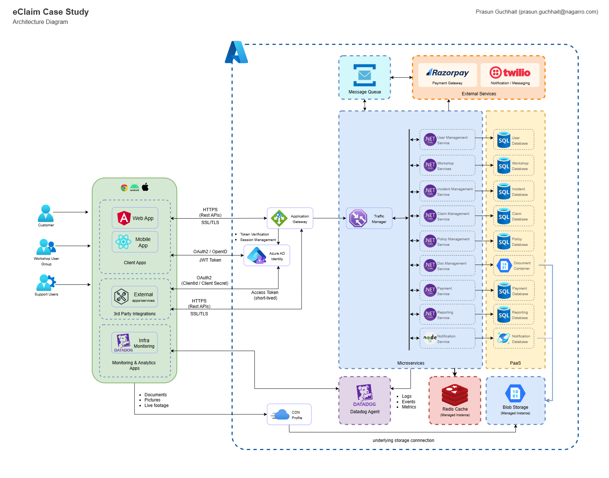
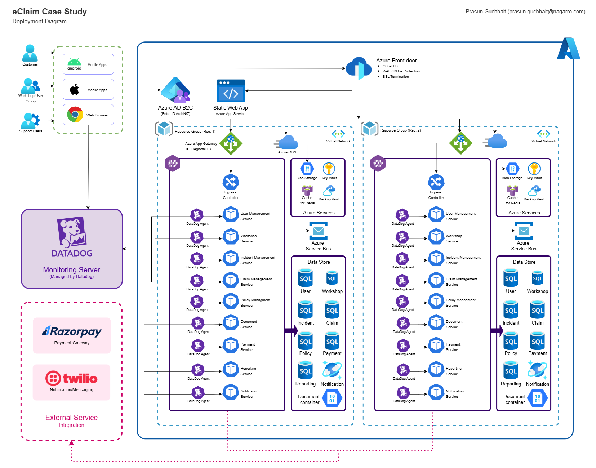
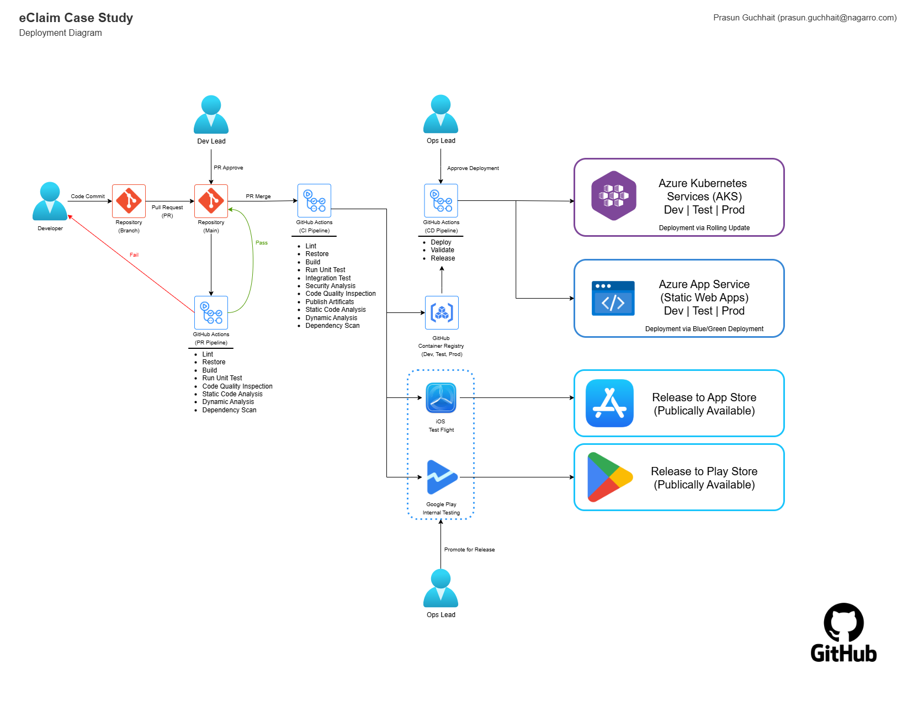

# eClaim Case Study – Root Repository

## 📑 Problem Statement
YCompany, with over 200M customers, is facing inefficiencies in its **manual claims processing system**:
- Claims take weeks to settle, causing customer dissatisfaction.  
- No real-time tracking for customers.  
- Manual processes for adjustors, surveyors, and workshops increase delays.  
- Lack of analytics, fraud detection, and reporting capabilities.  

The goal of this case study is to **modernize claims management** with a **scalable, secure, and cloud-ready digital solution** that delivers faster settlements, real-time transparency, and integration with partner ecosystems.  

---

## 🖼️ Architecture & Diagrams

### Architecture Diagram

### Deployment Diagram

### CI/CD Workflow

---

## 📂 POC Repositories

This root repository references multiple service and application repositories that form the Proof of Concept (POC).  

| Repository | Description | Current Status |
|------------|-------------|----------------|
| [eclaim-frontend](https://github.com/guchhaitprasun/eClaim-frontend) | Angular SPA (Customer Portal) |    |
| [eclaim-mobile](https://github.com/guchhaitprasun/eClaim-mobile) | React Native Mobile App |     |
| [eclaim-claims-service](https://github.com/guchhaitprasun/eClaim-claim-service) | .NET 8 Microservice (Claims Management) |      |
| [eclaim-notification-service](https://github.com/guchhaitprasun/eClaim-notification-service) | Node.js Microservice (Notifications) |      |
| Other services (to be added) | Future integrations (Car Rental, Workshop APIs, etc.) | ⏳ Planned |

⚠️ **Note:** The POC is **partially implemented** and not fully deployed due to lack of Azure subscriptions. Local scaffolding exists in these repositories.  

---

## 📧 Contact
For queries regarding this submission:  
**Prasun Guchhait** – prasun.guchhait@nagarro.com  
